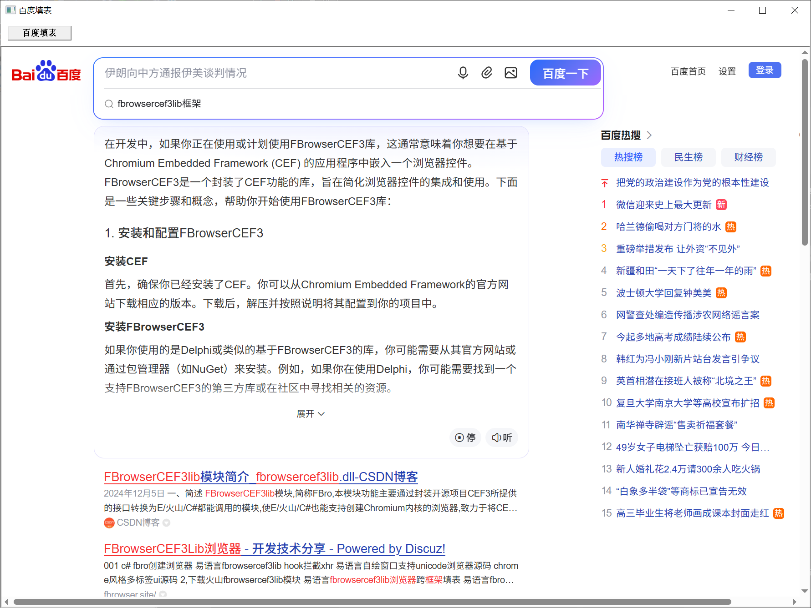
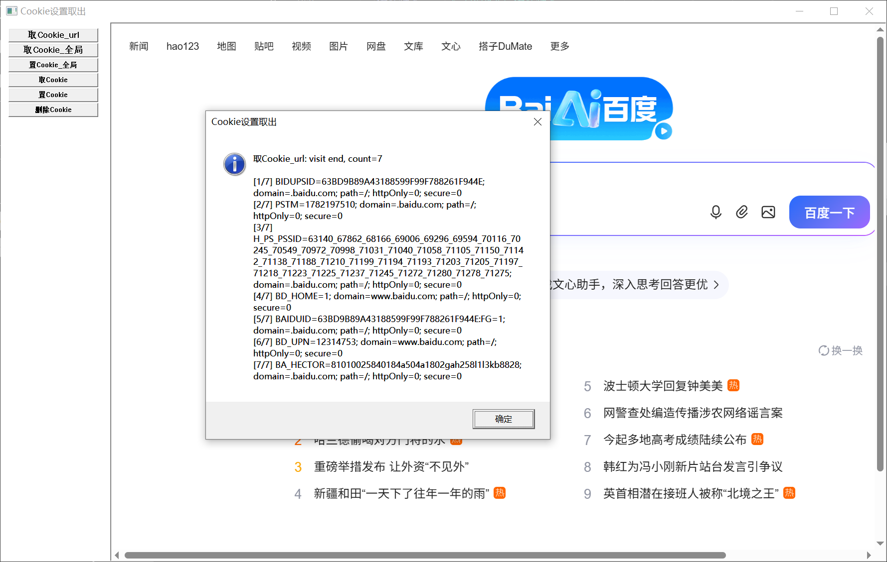

# FBroC++ Samples

[中文](README.md) | English

This repository contains C++ examples for using the FBro / FBrowser CEF module with Visual Studio and CMake. The samples are organized from Volcano FBrowser demos into small native C++ projects.

## Screenshots

### Browser Creation


### Baidu Form Fill



### Cookie Settings Demo



## Projects

- `NativeFBroDemo`
  - Demonstrates two browser creation modes:
    - Embedded FBro browser bound to a component `HWND`
    - Native CEF/Chrome popup with `SetAsPopup(nullptr, ...)`
  - Includes basic VIP / VIPControl test calls.

- `BaiduFormFill`
  - Opens Baidu in an embedded browser.
  - Fills the Baidu search box via JavaScript when clicking the button.

- `Cookie设置取出`
  - Opens Baidu in an embedded browser.
  - Provides six Cookie operation buttons:
    - `取Cookie_url`
    - `取Cookie_全局`
    - `置Cookie_全局`
    - `取Cookie`
    - `置Cookie`
    - `删除Cookie`

- `同步辅助类`
  - Opens Baidu in an embedded browser.
  - Provides four sync helper buttons:
    - `同步执行JS`
    - `同步取源码`
    - `同步取文本`
    - `同步创建浏览器`
  - Note: directly reproducing Volcano's `FBroHsBrowserFrame_ExecuteJavaScriptToHasReturn + FBroHsJsCallback` pattern in pure C++ triggers a Debug CRT heap assertion. This sample uses native CEF JavaScript execution plus a DOM marker readback as the stable alternative.

- `服务器`
  - Opens `http://coolaf.com/tool/chattest` in an embedded browser.
  - Clicking `创建服务器` calls `FBroHsServer_CreateServer("127.0.0.1", 8888, 100, ...)`.
  - Demonstrates HTTP response handling, WebSocket accept, and WebSocket message echo.

- `服务器Web`
  - Loads a local desktop web page inside the embedded browser.
  - Includes built-in `Connect` and `Send Test Message` buttons for direct WebSocket echo testing.
  - The verified stable pattern is:
    - cache inbound WebSocket messages inside `OnWebSocketMessage`
    - send the echo later from the main thread via a posted window message
  - This avoids heap corruption caused by synchronously calling `FBroHsServer_SendWebSocketMessage` inside the WebSocket message callback context.

- `创建URL请求`
  - Opens Baidu in an embedded browser.
  - Provides two URL request buttons:
    - `创建全局URL请求`
    - `创建框架URL请求`
  - The request URL follows the Volcano sample: `https://api.fbrowser.site:8443/`.
  - The stable implementation uses native CEF `CefURLRequest::Create`:
    - global request: no explicit `RequestContext`
    - frame/browser request: uses the current browser `RequestContext`
  - Note: directly using `FBroHsURLRequest_Create + a hand-written FBroHsURLRequestClient`, or `frame->CreateURLRequest`, triggers a Debug CRT heap assertion in pure C++.
  - The sample accumulates `OnDownloadData` chunks and prints the full response body on completion.

- `JS交互`
  - Creates an embedded HTML page with `FBroHsGetDataURI("text/html", html)`.
  - Simulates the Volcano sample's `cefQuery` and `cefQuerytest` JavaScript interaction entry points.
  - The stable implementation uses `OnConsoleMessage + ExecuteJavaScript` for JS/C++ two-way communication.
  - It intentionally avoids direct `FBroHsQueryFunctions + hand-written FBroHsQueryHandler` usage to prevent callback lifetime/allocation issues outside the Volcano runtime.

- `拦截获取简单示例`
  - Opens Baidu in an embedded browser.
  - Automatically listens for page resource responses and saves response bodies beside the executable under `CapturedResources`.
  - File extensions are matched from DevTools `mimeType` and URL suffixes, such as `.js`, `.png`, `.css`, `.woff2`, `.svg`, and `.json`.
  - The stable implementation uses DevTools Protocol `Network.responseReceived`, `Network.loadingFinished`, and `Network.getResponseBody`.
  - Note: directly returning `CefResponseFilter`, or reproducing Volcano's `FBroHsResponseFilter` callback in pure C++, triggers a Debug CRT heap assertion. This sample avoids the FBro ResponseFilter callback chain.

- `篡改资源实例`
  - Opens Baidu in an embedded browser.
  - Automatically intercepts `https://www.baidu.com/` and replaces the Baidu home page with local custom HTML.
  - The stable implementation uses DevTools Protocol `Fetch.enable`, `Fetch.requestPaused`, and `Fetch.fulfillRequest`.
  - This mirrors the Volcano resource-tampering demo that returns custom HTML from `GetResourceHandler`, while avoiding heap allocation risks from hand-written FBro ResourceHandler callbacks in pure C++.

- `VIPWebsocket拦截测试`
  - Opens `http://www.websocket-test.com/` in an embedded browser.
  - Provides seven feature buttons:
    - `启用websocket拦截`
    - `篡改链接`
    - `篡改文本数据`
    - `篡改字节集数据`
    - `发送文本数据`
    - `发送字节集数据`
    - `清空全部篡改数据`
  - This sample strictly uses the FBro VIP Hook path: `FBroHsVIPControl_EnableWebsocketClientHook(...)` and `FBroHsInitEvent::OnWebSocketClient*` callbacks.
  - Main-window buttons send commands to the render process through the FBro process-message channel; the render-side event stores `FBroDOMWssClient` and performs tampering or sending there.
  - Verified stable behavior:
    - `篡改文本数据` only changes text frames. The returned buffer size follows Volcano's `text-to-bytes(TRUE)` behavior and keeps the trailing `NUL`, so the server can echo the changed text normally.
    - `篡改字节集数据` only changes binary frames. The input box on `http://www.websocket-test.com/` sends text frames; forcing those frames to raw bytes such as `01 02 03 04` makes the server close the connection. This sample skips byte tampering for text frames to keep the connection alive.
    - Clicking text tampering clears byte tampering state, and clicking byte tampering clears text tampering state, preventing both modes from stacking.
  - Note: this sample does not use JShook and does not monkeypatch `window.WebSocket` from JavaScript.

- `VIP指纹测试`
  - Opens `https://gongjux.com/fingerprint/` in an embedded browser.
  - Provides five feature buttons:
    - `指纹刷新`
    - `获取指纹调用数`
    - `清空指纹调用数`
    - `篡改字节集数据`
    - `重新加载`
  - Reads `FBRO_VIP_LICENSE_KEY` from the local `.env` file and never stores the VIP license key in source code.
  - Uses FBro VIP fingerprint APIs to configure User-Agent, Canvas, WebGL, Audio, screen, language, hardware, WebRTC, timezone, and related fingerprint fields.
  - The byte-data tampering button writes fixed byte-style markers through FBro VIP constant fingerprint APIs and reloads the page for inspection.

- `VIP高级功能测试`
  - Opens Baidu in an embedded browser.
  - Follows the Volcano `VIP高级功能测试` sample and provides buttons for DevTools messages, VIP screenshot, touch/keyboard/mouse events, Runtime JavaScript, VIP filters, and VIP DOM operations.
  - Reads `FBRO_VIP_LICENSE_KEY` from the local `.env` file and never stores the VIP license key in source code.
  - DevTools / Runtime / DOM callback results are written to the window log box and to `vip-advanced-feature-demo.log` beside the executable.
  - DOM buttons that need a node id use the latest node id captured by `枚举DOM_同步`, `查询节点选择器_同步`, or `查询全部节点选择器_同步`.

## Important: deps.zip Is Not Included

This repository does not include `deps.zip` or the `third_party/fbro` dependency directory.

FBro is updated by its official maintainers, and the CEF runtime plus `.lib/.dll` files are large and version-sensitive. To keep the repository lightweight and avoid stale dependencies, please obtain the dependencies from the official FBro package or from your local Volcano FBrowser module installation.

VIP license keys are not committed either. To test VIP features, copy `.env.example` to a local `.env` file and put your own key there.

## Dependency Layout

Create this directory layout at the repository root:

```text
third_party/
  fbro/
    FBrowserCEF3lib/
    lib64/
    CEFLib64/
```

Typical mapping from the Volcano module package:

```text
FBrowser/src/env/FBrowserCEF3lib  -> third_party/fbro/FBrowserCEF3lib
FBrowser/src/env/lib64            -> third_party/fbro/lib64
FBrowser/src/CEFLib64             -> third_party/fbro/CEFLib64
```

## Build

Requirements:

- Windows
- Visual Studio 2022 with MSVC x64
- CMake 3.20+
- 64-bit FBro / FBrowser CEF dependencies

Commands:

```powershell
cmake -S . -B build -A x64
cmake --build build --config Debug
```

Generated solution:

```text
build/FBroCppSuite.sln
```

## Run

After build, each project copies `third_party/fbro/CEFLib64` into its executable output directory.

Example outputs:

```text
build/NativeFBroDemo/Debug/NativeFBroDemo.exe
build/BaiduFormFill/Debug/BaiduFormFill.exe
build/Cookie设置取出/Debug/CookieSettingsDemo.exe
build/同步辅助类/Debug/SyncHelperDemo.exe
build/服务器/Debug/ServerDemo.exe
build/服务器Web/Debug/ServerWebDemo.exe
build/创建URL请求/Debug/URLRequestDemo.exe
build/JS交互/Debug/JSInteractionDemo.exe
build/拦截获取简单示例/Debug/ResourceInterceptDemo.exe
build/篡改资源实例/Debug/ResourceTamperDemo.exe
build/VIPWebsocket拦截测试/Debug/VIPWebsocketInterceptDemo.exe
build/VIP指纹测试/Debug/VIPFingerprintDemo.exe
build/VIP高级功能测试/Debug/VIPAdvancedFeatureDemo.exe
```

## Encoding Rule

To avoid Chinese text corruption under the current MSVC code page, prefer Unicode escapes in C++ UI strings:

```cpp
L"\u767e\u5ea6\u586b\u8868"
```

For embedded HTML pages, HTML entities are also recommended:

```html
JS&#20132;&#20114;&#27979;&#35797;
```

## License

This repository only contains sample source code and build configuration. Follow the official license terms for FBro / FBrowser, CEF, and related runtime files.
